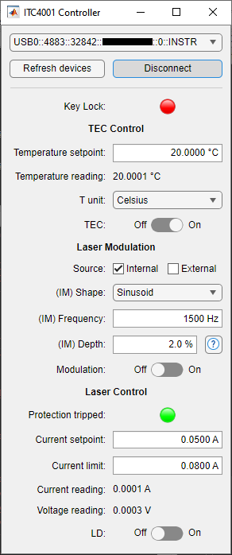

# Thorlabs ITC4000-series matlab class
Simple matlab class and gui to control the
[Thorlabs ITC4000-serier Benchtop Laser Diode/TEC Controller](https://www.thorlabs.com/newgrouppage9.cfm?objectgroup_id=4052).

## Status
Working well with a few different ITC4001s, I should probably do some more
rigorous testing tho.

## Min matlab version
I *think* R2021a, but I'm not sure. Please send an
[email](mailto:ragnar.seton@uit.no)
if it turns out I'm wrong on this.

## Other Requirements
This class requires the
[Instrument control toolbox](https://se.mathworks.com/products/instrument.html)
and unfortunately also a VISA driver. While matlab's VISA interface
[reportedly](https://se.mathworks.com/help/releases/R2024b/instrument/troubleshooting-visa-interface.html)
still works on intel-based macs I haven't tried it. So if your using a modern
computer you're stuck with windows.
[Mathworks lists](https://se.mathworks.com/help/releases/R2024b/instrument/troubleshooting-visa-interface.html)
three different VISA drivers but I've only tested the class with the one from
[Rohde & Schwartz](https://www.rohde-schwarz.com/no/applications/r-s-visa-application-note_56280-148812.html),
I would advice against using the NI one since the install process is completely
broken.

## Install
You can just download this repo to your ~/Documents/MATLAB folder, unzip it and
run
```
addpath([userpath(), filesep(), 'itc4k']);
```
Maybe I'll publish it on the file exchange once I get around to mirroring this
repo on github.

## Basic usage
Connect your ITC4000-series driver with a usb cable, turn it on and run
`ITC4k.gui()`.

## Advanced usage
See `help ITC4k`.

## Notes
I want to emphasize *simple class*, you really can't do much more than set the
setpoint for the TEC, LD, adjust some LD amplitude and modulation settings and
turn them on/off. It shold be fairly easy to extend tho. All the controlling
logic is in the ITC4k-class, the gui is just a static function that creates
an object and provides a uifigure-based user interface to it.

## Screenshot

